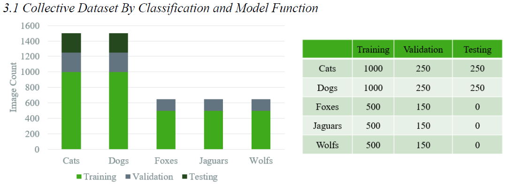
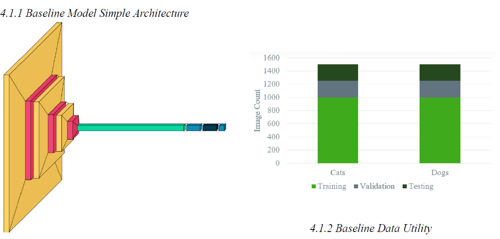
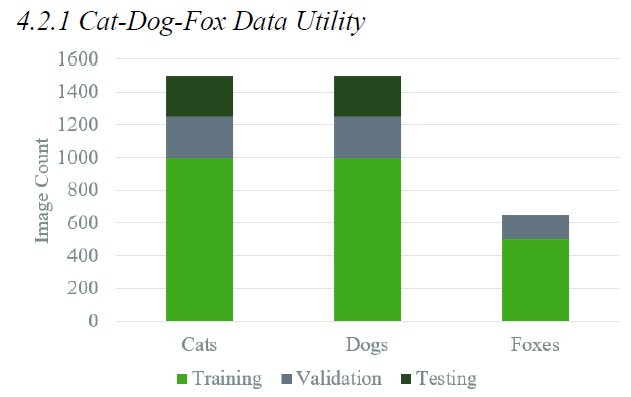
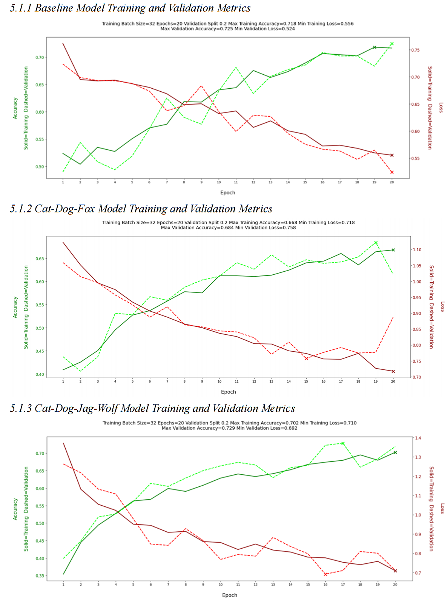
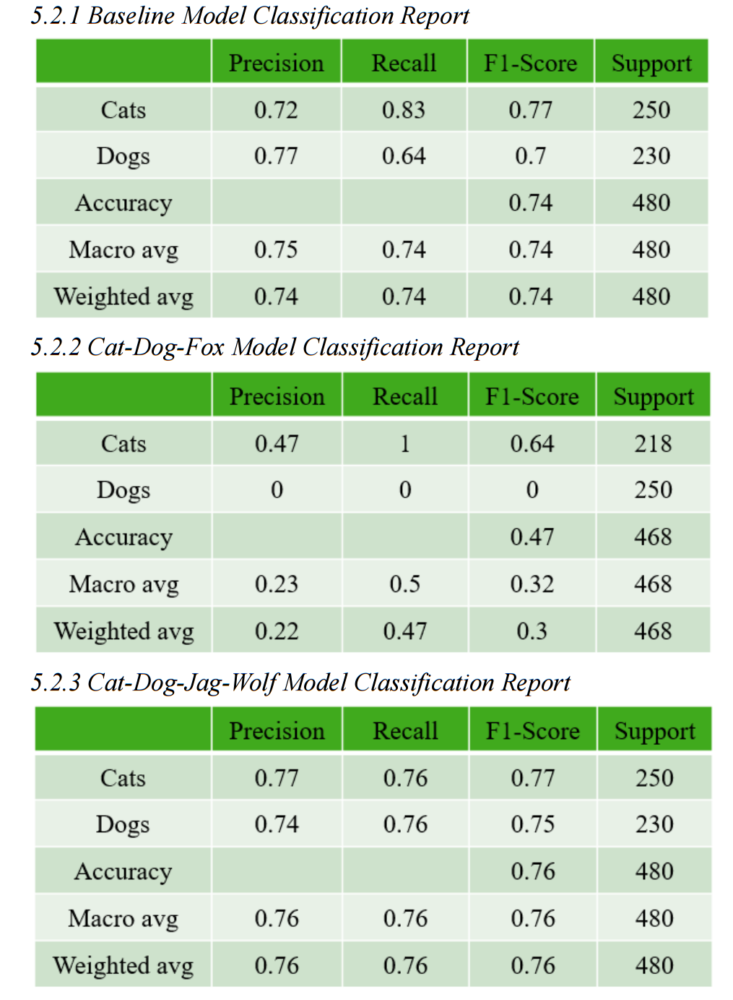
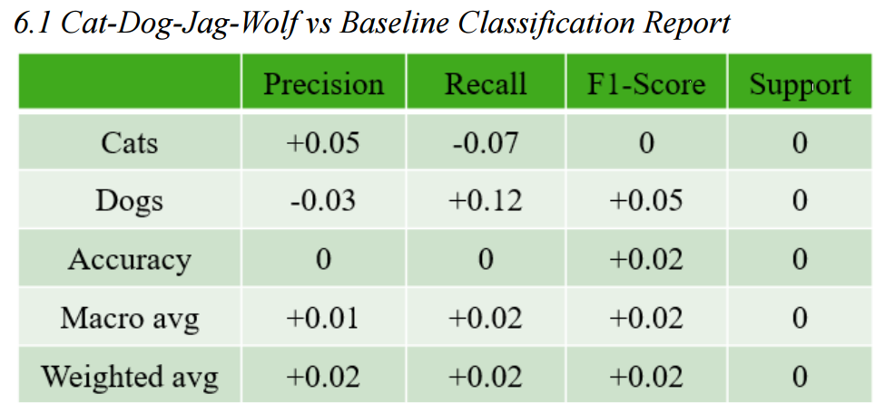

In an effort to further understand the limitations and benefits of transfer learning, this paper introduces a variation titled Parallel Transfer Learning. Transfer Learning is typically a linear and s[...]

Another way of looking at PTL is training a multi-class classifier, then making predictions on data that represents a smaller subset of the initial classes. The key being that the initial extraneous c[...]

The scope of PTL is slightly different from that of traditional transfer learning. Contemporary transfer learning focuses on using powerful existing resources to make a comprehensive model. PTL is an [...]

The general procedure structured path of comparison. In all, 3 models/trials were run. A baseline followed by two combinations of different supplemental classes added to the training data. These addit[...]

When examining how the different models’ accuracy and loss evolved over time/epochs, they all demonstrated comparable results. They all seemed to train reasonably well with the validation loss/accur[...]

The Dog-Cat-Fox model did not perform well at all, almost to an unexpected degree. It was not successful at all with an overall accuracy of 47%. It had perfect recall with all the cats images in the t[...]

The Dog-Cat-Jag-Wolf model showed more promising results with an accuracy of 76%. The performance metrics for this model were very similar to the baseline model, but marginally better. Not nearly enou[...]

Whether or not this represents an overall improvement depends on the hypothetical use case of the model. But more than just raw predictive power increase, the supplemental wolf and jaguar data seemed [...]

Ultimately the Cat-Dog-Jag-Wolf model produced the best results of the experimental trials. While it was not a conclusive and total victory for PTL, it did demonstrate marginal improvements to both to[...]

PLT wrestles with some large questions that are imperative to both human and machine cognitive reasoning. Does knowledge about what is and is not a wolf help shape our understanding of what a dog is? [...]

There are so many variations on the experimental trials that could illuminate novel relationships and implications for training with data from different domains. Repeating the trials with larger suppl[...]
