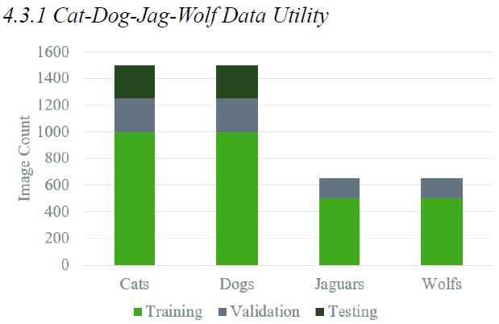

# Preface
Below is a reduced form factor of the full paper in this repo. Please keep in mind that this is an unorthodox deep learning experiment, so the methodology may also seem unorthodox. The conclusions are also extremely preliminary. Please try to see it for the novel research question it aims to explore. 

# Intro
In an effort to further understand the limitations and benefits of transfer learning, this paper introduces a variation titled Parallel Transfer Learning. Transfer Learning is typically a linear and sequential process where a large scale or related source model is trained, and its architecture and learned features are augmented to make predictions for a smaller target dataset. The pretrained model is the dominant presence in the model. PTL is not sequential and doesn’t require pretraining. Instead it combines the target task data with a smaller set of related supplemental data, trains on the combined dataset all at once, and then makes predictions about just the target data.

Another way of looking at PTL is training a multi-class classifier, then making predictions on data that represents a smaller subset of the initial classes. The key being that the initial extraneous classes are deliberately selected in relation to the smaller target subset. This paper focuses on implementing this with Convolutional Neural Network (CNN) aimed at distinguishing between images of cats and dogs. The same CNN model was trained to classify cats, dogs, and other related animals (foxes, wolves, jaguars) and attempted to classify the same test set containing images of only cats and dogs.

The scope of PTL is slightly different from that of traditional transfer learning. Contemporary transfer learning focuses on using powerful existing resources to make a comprehensive model. PTL is an exploration in using additional data as a lightweight and easy to implement model booster. So the scope of this paper is far from exhaustive and more focused on laying the groundwork for pressing questions in the space.

# Methods
The general procedure structured path of comparison. In all, 3 models/trials were run. A baseline followed by two combinations of different supplemental classes added to the training data. These additional classes were also added to the validation data to make sure the training evolved reasonably well, and that any surprising outcomes with the test data were not due to poor/over training. The models were all compiled with the Adam optimizer and were trained for 20 epochs. But the supplemental data was never added to the final test data, as all three models made predictions on a dataset of only cats and dogs with their predictions also limited to either cats or dogs. Finally the efficacy of these predictions were evaluated and compared.

# Analysis

When examining how the different models’ accuracy and loss evolved over time/epochs, they all demonstrated comparable results. They all seemed to train reasonably well with the validation loss/accuracy following their training counterparts well. There were some slight differences in the loss/accuracy cures and how steep they were at a given epoch. But generally I would say all of them are fairly conservative/flat, and if model optimization was the objective, these trials could benefit from an increased learning rate. Additionally given the trajectory and clear grouping of the curves, it is evident that the models have learned, but are actually somewhat undertrained. Again, because maximized performance is not the focus, the models being partially trained with the same number of epochs is actually perfect. It means comparisons between the models can be made at a benchmarked level of training, without wondering if measured differences could erroneously be attributed to overtraining or oversight.

The Dog-Cat-Fox model did not perform well at all, almost to an unexpected degree. It was not successful at all with an overall accuracy of 47%. It had perfect recall with all the cats images in the test set, but at the trade off of 100% incorrect precision and recall with dogs. The model shifted drastically to only predict cats 100% of the time, regardless of input. This was initially assumed to be due to some extraneous error, but none was found. The one-hot formatted outputs were showing very similar values for cats and dogs most of the time, but always slightly higher in favor of the cat label. This is clearly an example of negative transfer learning as outlined in section 2, where model performance is worse than without the added data. The exact mechanics are subject to further investigation, but it seems like the addition of the fox data either introduced bias in the model. One possible explanation is that the smaller fox dataset made the whole training set unbalanced. These results do not indicate this model is impossible to train properly, but it is worth noting how drastically the added data affected the model.

The Dog-Cat-Jag-Wolf model showed more promising results with an accuracy of 76%. The performance metrics for this model were very similar to the baseline model, but marginally better. Not nearly enough to assert claims about the supplemental data being a superior approach, but the results are not trivial either. Fig 6.1 shows the difference from the baseline performance. A positive number means that the Dog-Cat-Jag-Wolf model had a higher metric in that area.

# Conclusion
Whether or not this represents an overall improvement depends on the hypothetical use case of the model. But more than just raw predictive power increase, the supplemental wolf and jaguar data seemed to balance out the model a bit more. This model had significantly less tradeoff between precision/recall and between the target classes. This is further supported by findings in (Caruana 1997, 41-75) that MTL and joint training can have the effect of regularizers.

Ultimately the Cat-Dog-Jag-Wolf model produced the best results of the experimental trials. While it was not a conclusive and total victory for PTL, it did demonstrate marginal improvements to both total accuracy and how robust different types of classification predictions would be. And even the complete failure of the Cat-Dog-Fox model provides value. It issues a warning of how massively detrimental bias can be introduced by closely related or unbalanced data.

PLT wrestles with some large questions that are imperative to both human and machine cognitive reasoning. Does knowledge about what is and is not a wolf help shape our understanding of what a dog is? Along with these large scale questions are the immediate needs the PLT seeks to address. As AI scales, it needs ways to remain agile and accessible. PLT in its current form may not be the perfect, dynamic, and lightweight model booster. But to at least some degree, these models gave evidence of parallel/shared feature representation working to a model’s advantage with a very simple setup.

There are so many variations on the experimental trials that could illuminate novel relationships and implications for training with data from different domains. Repeating the trials with larger supplemental datasets so that the collective training set is balanced could remedy some of the observed bias issues. And training with less related image data could reveal limitations on shared feature learning. Not to mention further training and optimizing the models show here to see if their maximum performance varies. Any explorations in this space are an investment in the future enablement of AI practitioners.
